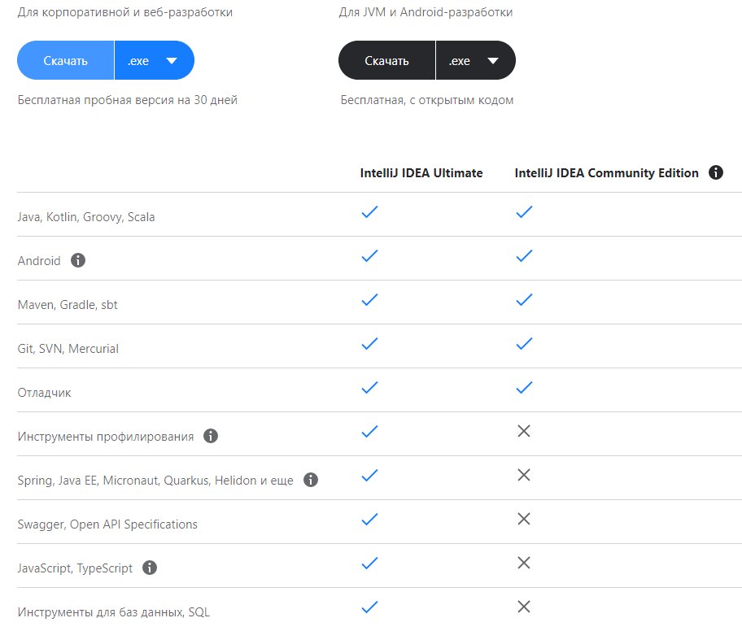
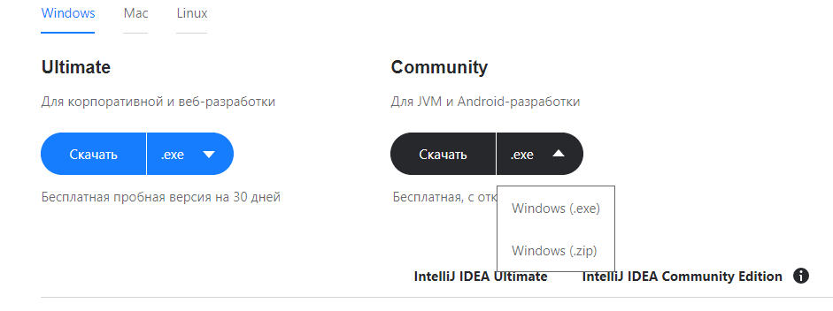
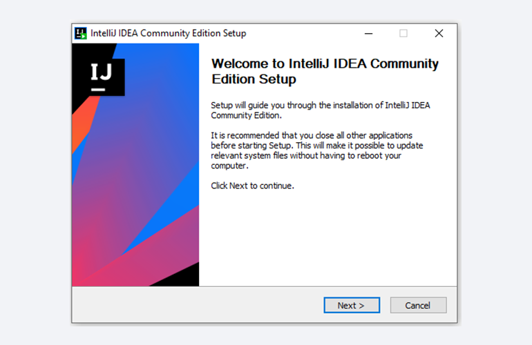
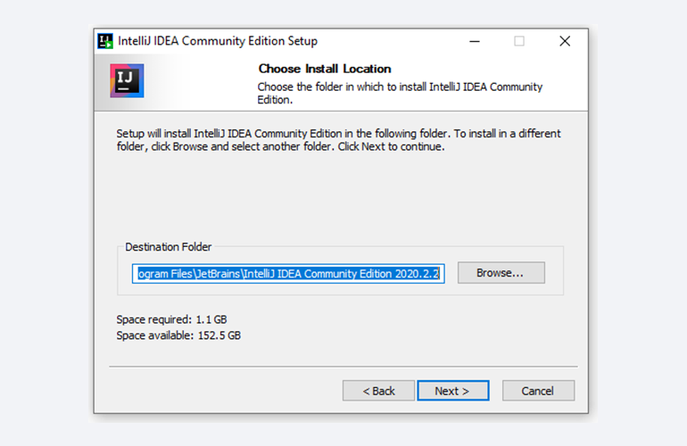
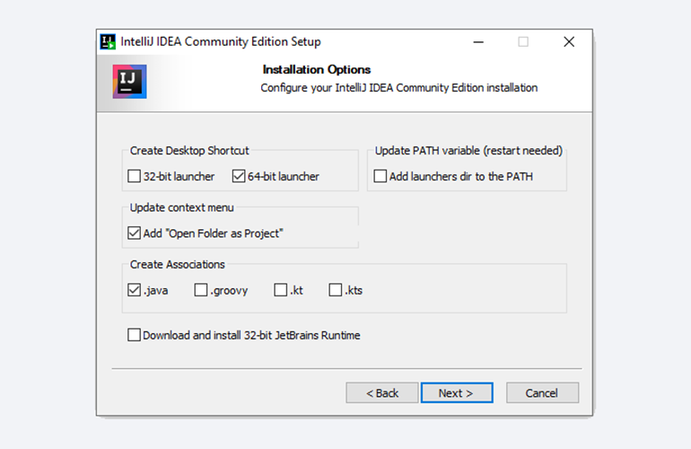
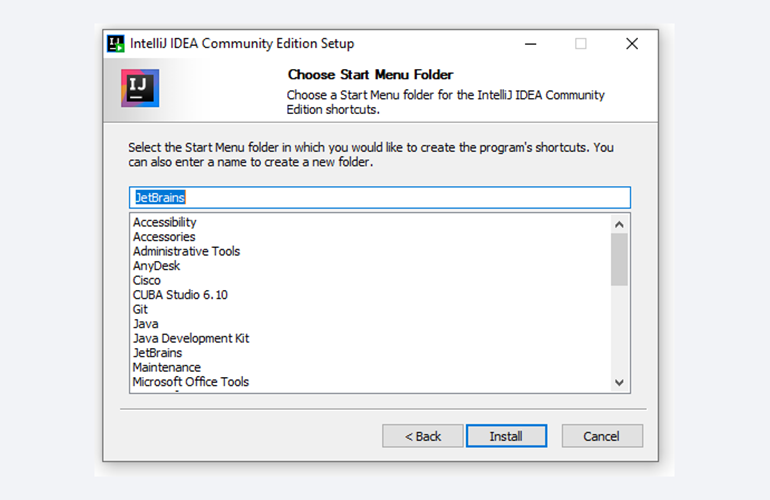
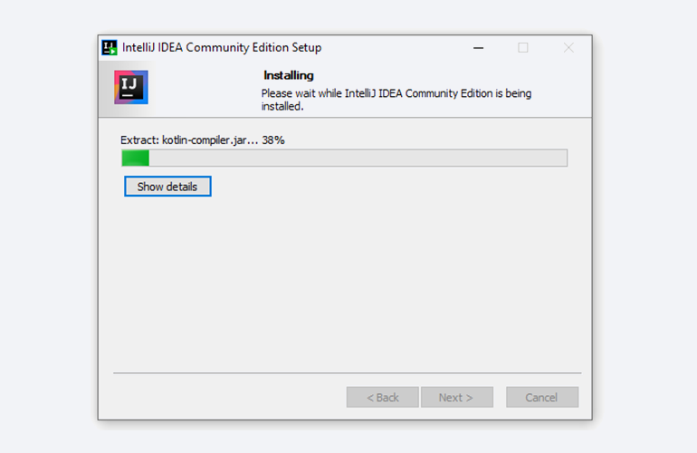
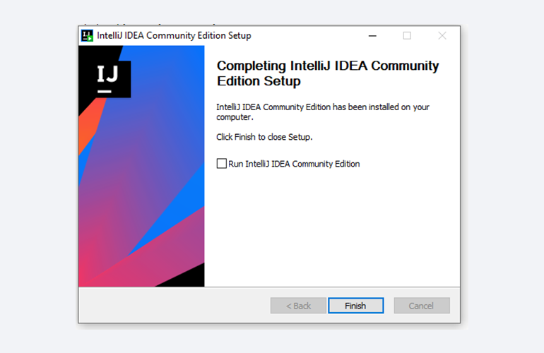
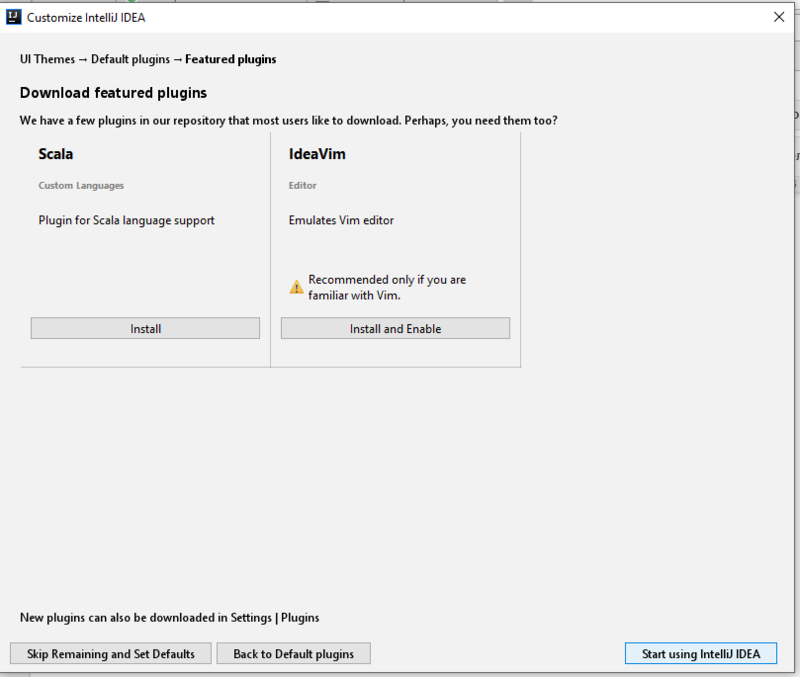
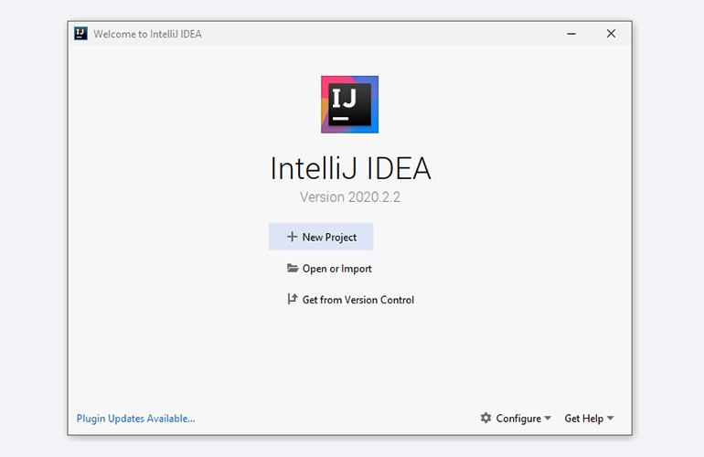

# Установка среды разработки IntelliJ IDEA Community (Windows)

Intellij IDEA — это интегрированная среда разработки (IDE), то есть система программных средств для создания проектов на разных языках программирования.

Сегодня это самая популярная IDE для языка Java. А ещё есть Eclipse, NetBeans и немало других, но мы рекомендуем именно IDEA, потому что даже её бесплатная версия обладает широкой функциональностью, подходит для профессиональной разработки и вообще делает Java проще в использовании.

В IDE обязательно входят:
* текстовый редактор для написания кода (он знает синтаксис нужных языков)
* компилятор
* отладчик

## 1. Какую версию (редакцию) выбрать

Intellij IDEA доступна в бесплатной (Community) и платной (Ultimate) версиях. Чем они различаются, видно на скриншоте ниже:

Пока что нам хватит возможностей бесплатной версии.

**На заметку**: IntelliJ предлагает студентам и преподавателям [свободный доступ](https://www.jetbrains.com/ru-ru/community/education/#students) к своим продуктам.

## 2. Сама установка

Заходим на [сайт производителя](https://www.jetbrains.com/ru-ru/idea/download/#section=windows) и качаем версию для Windows:

Запускаем скачанный файл `.exe`:

Жмём `Next`(Далее) и выбираем путь для установки:

Снова жмём `Next`(Далее) и настраиваем параметры установки:

В общем случае это:
* `64-bit launcher` — для запуска 64-разрядной версии приложения (будет создан ярлык на рабочем столе)
* `Add "Open Folder as Project"` — позволяет открывать папки с исходниками как проекты прямо через контекстное меню
* `.java` — файлы такого типа (с таким расширением) будет открывать IDEA (по умолчанию и через контекстное меню)

Жмём `Next`(Далее) и выбираем папку для ярлыков IDEA (оставляем по умолчанию):

Нажимаем `Install`(Установить), после чего стартует установка:

Дожидаемся её окончания и жмём `Finish`(Завершить):

## 3. Запуск IntelliJ IDEA и настройка параметров

При первом запуске принимаем пользовательское соглашение и нажимаем `Continue`(Продолжить):

Далее выбираем тему оформления (доступны `тёмная` или `светлая`):

Жмём `Next: Default plugins`(Далее Плагины по умолчанию) и переходим к выбору устанавливаемых плагинов:

Жмём `Disable`(Отключить) чтобы отключить установку ненужных плагинов:
* `Swing` - `Disable`
* `Android` - `Disable`
* `Plugin Development` - `Disable`

Нажимаем `Next: featured plugins`(Далее Плагины дополнительные) и выбираем нужный нам `Scala` плагин:

Обязательно выбираем `Install`(Установка) для `Scala`

И наконец, нажимаем `Start using Intellij IDEA`

Вас встретит начальный экран среды разработки `Welcome screen`.
Здесь можно:
* `New Project` - создать новый проект
* `Open or Import` - открыть или импортировать существующий 
* `Get from Version Control` - скачать проект из системы контроля версий(`Git`, `GitHub` и др.)

